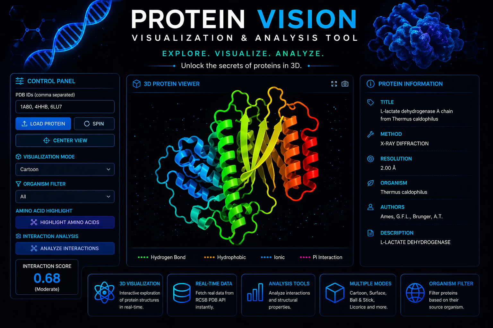

# 🧬PROTEIN VISION

  

<

---

## 🔬 Description

**Protein Vision** is an interactive web-based application designed to visualize and analyze protein structures in a dynamic 3D environment. The tool leverages real-time biological data from the **RCSB Protein Data Bank (PDB)** and renders it using advanced molecular visualization techniques.

The application allows users to input Protein Data Bank (PDB) IDs and instantly load corresponding protein structures. These structures are displayed in a fully interactive 3D viewer where users can rotate, zoom, and inspect the molecule from different angles.

To enhance analysis, the tool provides multiple visualization modes such as **cartoon, surface, ball-and-stick, and licorice**, enabling users to view proteins at different levels of detail.

It also includes a **toggle-based amino acid highlighting feature**, which helps in identifying the fundamental building blocks of proteins.

Additionally, the system fetches and displays important metadata such as:
- Title  
- Experimental Method  
- Resolution  
- Organism  
- Authors  

A basic **interaction analysis module** is also implemented, which visually represents relationships between protein structures and provides an interaction score.

This project is entirely frontend-based and uses:
- HTML  
- CSS  
- JavaScript  
- NGL Library  

Instead of a traditional backend, it integrates directly with the **RCSB API**, making it lightweight and efficient.

---

## ⚙️ Features

- 🧬 3D Protein Visualization  
- 📡 Real-time API Integration (RCSB PDB)  
- 🎨 Multiple Visualization Modes  
- 🧪 Amino Acid Highlighting (Toggle)  
- 🔄 Spin & Center Controls  
- 📊 Protein Metadata Display  
- 🔗 Interaction Analysis  

---

## 🚀 How to Use

1. Enter a valid PDB ID (e.g., `1TUP`, `1A3N`)  
2. Click **Load Protein**  
3. Explore the structure using:
   - Rotate  
   - Zoom  
   - Change view mode  
4. Use **Amino Acids button** to highlight structure  
5. View protein details in the info panel  

---

## 🧠 Tech Stack

- **Frontend:** HTML, CSS, JavaScript  
- **Visualization:** NGL Viewer  
- **API:** RCSB Protein Data Bank  
- **Deployment:** GitHub Pages  

---

## 🌐 Live Demo

👉 https://sridevir872-cloud.github.io/protein-viewer/

---

## 🎯 Applications

- 📚 Educational learning  
- 🧬 Bioinformatics exploration  
- 🔬 Research visualization  
- 💊 Drug discovery basics  

---

## 🚀 Future Scope

- Real interaction analysis  
- Binding site detection  
- AI-based predictions  
- Drug design integration  

---

## 👩‍💻 Built By

**G Sridevi Reddy**

---

## ⭐ Acknowledgements

- RCSB Protein Data Bank  
- NGL Viewer Library  

---
